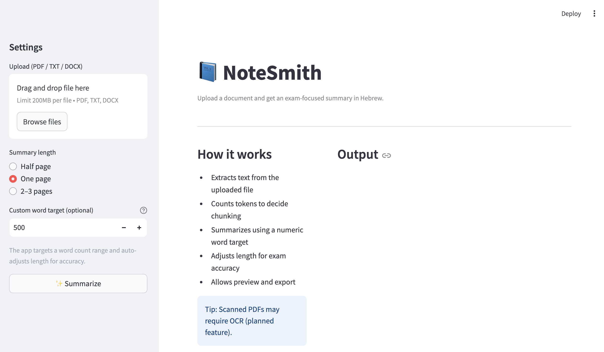

# 📘 NoteSmith – AI Exam Summarizer

NoteSmith is an **Applied AI / Product AI** project that summarizes academic documents for exam preparation, with **precise control over summary length** and a clean, user-friendly UI.

The system is designed to handle **large documents**, automatically decide when to use chunking based on token count, and produce **structured Hebrew summaries** optimized for studying.

---

## ✨ Key Features

- 📄 Upload **PDF / TXT / DOCX**
- 🧠 **Token-aware chunking** (handles large documents safely)
- 🎯 **Numeric word target** (accurate length control)
- 🇮🇱 Hebrew summaries with **automatic RTL / LTR detection**
- 🧩 Multi-pass summarization for quality & consistency
- 🖥️ Clean **Streamlit UI**
- 📥 Export summaries as Markdown

---

## 🧠 How It Works (High Level)

1. **Text Extraction**  
   Extracts text from uploaded documents (PDF / TXT / DOCX).

2. **Token Analysis**  
   Counts tokens to decide whether chunking is required.

3. **Summarization Logic**
   - Small input → single-pass summary
   - Large input → chunk summaries → final consolidation pass

4. **Length Accuracy**
   - Uses a numeric target word count
   - Second pass expands or compresses to stay within ±10%

---

## 🖥️ User Interface



---

## 🛠️ Tech Stack

- **Python**
- **OpenAI API**
- **Streamlit**
- **tiktoken**
- Modular architecture:
  - `agent/` – orchestration & logic
  - `tools/` – summarization & extraction
  - `shared/` – token & length utilities
  - `UI/` – Streamlit frontend

---

## 🚀 Getting Started

### 1. Install dependencies
```bash
pip install -r requirements.txt